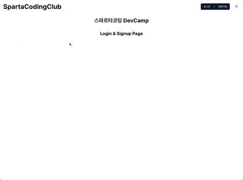

# Sparta DevCamp Auth AuthPage

## Description
> 스파르타 코딩 클럽 DevCamp에서 진행한 회원가입 및 로그인 페이지.

## 사용 Framework & Library
- Next.js
- chadcn/ui
- zod
- react-hook-form
- framer-motion
- zustand

### 회원가입 페이지
- 2단계 회원가입 페이지
  - 1단계: 이름, 이메일, 전화번호, 유저 역할
  - 2단계: 비밀번호, 비밀번호 확인
- 단계별로 상단에 프로그래스 바 표시
- 각 필드별 유효성 검사
- json-server-auth 이용하여 회원가입 구현

### 실행방법
- .env.local 설정
```dotenv
NEXT_PUBLIC_JSON_SERVER_URL=http://localhost:8000
```
- 실행
```bash
  # next.js dev 실행
  yarn dev
  # next.js build
  yarn build
  # next.js build 버전 실행
  yarn start
  
  # json-server-auth 실행
  yarn server 
  ```
### 회원가입 실행화면

