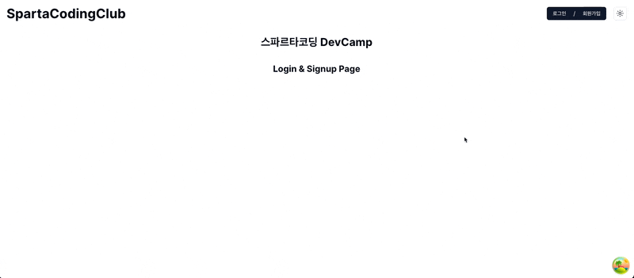

# Sparta DevCamp Auth AuthPage

## Description
> 스파르타 코딩 클럽 DevCamp에서 진행한 회원가입 및 로그인 페이지.

## 사용 Framework & Library
- Next.js
- chadcn/ui
- zod
- react-hook-form
- framer-motion
- zustand
- next-auth
- json-server, json-server-auth

### 회원가입 페이지
- 2단계 회원가입 페이지
  - 1단계: 이름, 이메일, 전화번호, 유저 역할
  - 2단계: 비밀번호, 비밀번호 확인
- 단계별로 상단에 프로그래스 바 표시
- 각 필드별 유효성 검사
- json-server-auth 이용하여 회원가입 구현

### 로그인 페이지
- 이메일, 비밀번호 입력 후 로그인
- next-auth를 이용하여 로그인 구현
  - 아직 에러 페이지 처리는 하지 못함 

### 실행 전 설정
- db.json 파일 생성
```json
{
  "post": [
    {
      "title": "Hello World",
      "content": "This is my first post!"
    }
  ],
  "users": [
  ]
}
```
```bash
openssl rand -base64 32
// 여기서 찾은 정보를 .env.local NEXTAUTH_SECRET에 넣어준다.
```
- .env.local 설정
```dotenv
NEXT_PUBLIC_JSON_SERVER_URL=http://localhost:8000
NEXTAUTH_URL=http://localhost:3000
NEXTAUTH_SECRET=

```

### 실행방법

- 실행
```bash
  # 의존성 패키지 설치
  yarn install
  # next.js dev 실행
  yarn dev
  # next.js build
  yarn build
  # next.js build 버전 실행
  yarn start
  
  # json-server-auth 실행
  yarn server 
  ```
### 회원가입 실행화면

### 로그인 실행화면
